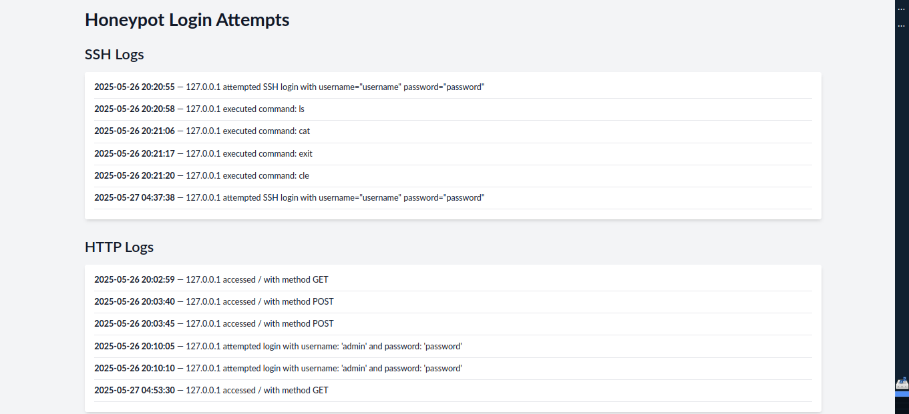

# 🛡️ Honeypy – SSH & HTTP Honeypot with Live Dashboard

Honeypy is a lightweight, customizable honeypot system designed to mimic vulnerable **SSH** and **HTTP login services**, capture attack attempts, and display them in a live **web-based dashboard**.

Built for learning, monitoring, and basic threat intelligence collection, it's ideal for cybersecurity students, CTF organizers, researchers, and hobbyists.

---

## 📸 Preview

  
_Real-time attack logs displayed in the web dashboard_

---

## 🚀 Features

✅ **SSH Honeypot** — Logs IPs, usernames, passwords used in brute-force attempts  
✅ **HTTP Honeypot** — Fake login page capturing credentials  
✅ **Live Web Dashboard** — Flask-based dashboard for real-time monitoring  
✅ **Threaded Execution** — Run dashboard and honeypots simultaneously  
✅ **Simple Logging** — All events saved to organized `.log` files  
✅ **Command-line Config** — Easily configure address, ports, and credentials

---

## 🧪 How It Works

Honeypy simulates vulnerable endpoints:
- **SSH Honeypot** uses Paramiko to fake a shell and log credentials.
- **HTTP Honeypot** runs a fake login form and logs POST attempts.
- **Dashboard** uses Flask to read logs and show events in a web UI.

All logs are stored in the `logs/` directory and displayed live in the dashboard.

---

## 🛠️ Requirements

- Python 3.8+
- Flask
- Paramiko

Install them:

```bash
pip install -r requirements.txt
